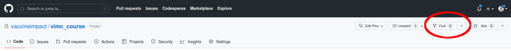
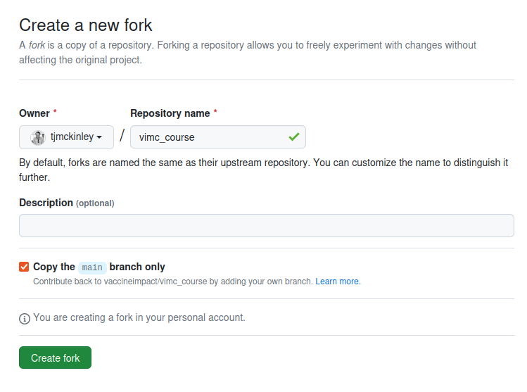
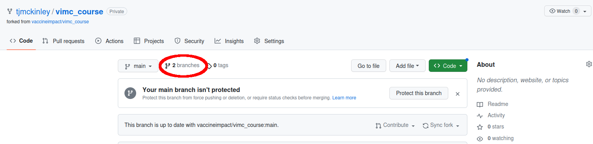
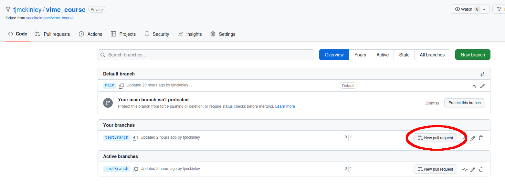
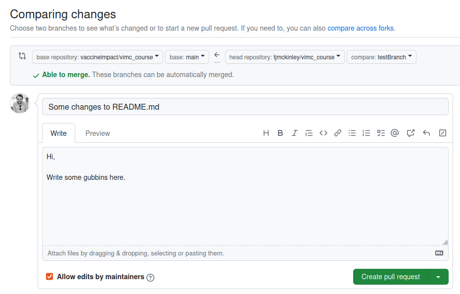
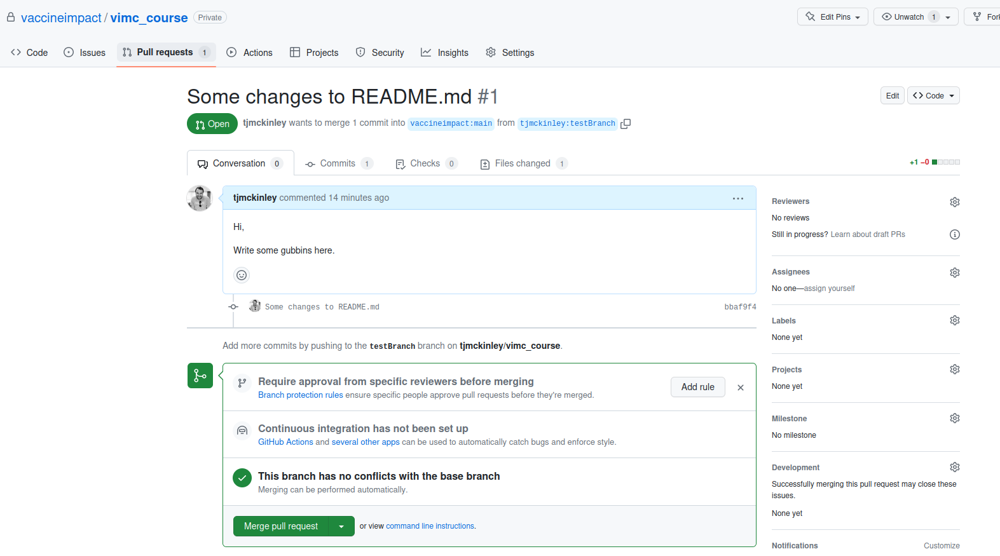

```{r setup, include=FALSE}
knitr::opts_chunk$set(echo = TRUE)
library(knitr)
```

For ease-of-updating, to aid reproducibility and to keep all materials consistent in format, we have decided to use a specific template based on [bookdown](https://bookdown.org/). This has some custom features and personalisation for this course. 

You will need to install the `bookdown` package, and I would also recommend installing [TinyTeX](https://yihui.org/tinytex/). These can be installed in the usual way (note that `tinytex` is an R package, but TinyTeX is a LaTeX distribution which can be installed using the `tinytex` package as detailed below):

```{r, eval = FALSE}
## install bookdown
install.packages("bookdown")

## install the tinytex R package
install.packages("tinytex")

## now install the 
tinytex::install_tinytex()
## to uninstall TinyTeX, run tinytex::uninstall_tinytex()
```

TinyTeX is a light-weight TeX distribution, and if you come across any errors relating to e.g. missing `.sty` files when compiling, then you can search for the correct package and install it using `tinytex` as detailed below. For example, if you are missing the `times.sty` file, then you can search for which package it is in and then install that package using e.g. 

```{r, eval = FALSE}
library(tinytex)
tlmgr_search('/listings.sty')   ## search for listings.sty
tlmgr_install('listings')       ## install the listings package
tlmgr_update()                  ## update TeX installation
```

Please see the Maintenance section at [https://yihui.org/tinytex/](https://yihui.org/tinytex/) or contact me if you have any issues. If you are using another type of LaTeX distribution (such as TeXlive or MikTeX), then you can install the missing packages in the usual way.

The main repository for these course materials can be found at: [https://github.com/vaccineimpact/vimc_course](https://github.com/vaccineimpact/vimc_course). 

You can clone or download the materials from this central repository, but as is best practice, only the course administrators have write access to this central repository. Therefore, to make changes and updates, the following workflow is required. Note that this requires some knowledge of Git procedures, such as **cloning**, **forking**, **pushing** and **pulling**. I have tried to detail the workflow below, but if anyone has any questions or anything is unclear, please just e-mail me.

**Alternatively**, if you really aren't comfortable with Git, then please just download the current PDF version of the notes from: [https://vaccineimpact.github.io/vimc_course/_main.pdf](https://vaccineimpact.github.io/vimc_course/_main.pdf), annotate the PDF and then forward suggestions to me and I will update the notes for you.

\begin{tcolorbox}
For information on how the template works, please see the \href{https://github.com/vaccineimpact/vimc_course}{\texttt{README.md}} file in the main repository.
\end{tcolorbox}

\begin{tcolorbox}
\textbf{Note:} any dependency R packages used in the notes will need to be installed. Since the notes can change over time I haven't added a compilation script for these, but the code should throw an error if packages are missing and tell you which ones you should install. Please let me know if you have any issues with installing any of the packages.
\end{tcolorbox}

For the following steps, each lecturer should have their own personal GitHub account set up and be logged in. Note that GitHub recently changed their access protocol, and so when pushing and pulling to a GitHub repo using HTTPS then you might require a Personal Access Token (PAT) to be set-up. Some information about this can be found at [https://happygitwithr.com/https-pat.html](https://happygitwithr.com/https-pat.html). Again, please let me know if you have any problems with this.

1. Firstly, create a **fork** of the main repository into you own personal GitHub account.

    To do this, navigate to the main page at [https://github.com/vaccineimpact/vimc_course](https://github.com/vaccineimpact/vimc_course), and then click on the {height=15px} button as shown below:
    
    ```{r, echo = FALSE, out.width = "100%", fig.align = "center"}
    
    ```
    
    This will take you to a confirmation screen where you can click {height=15px}:
    
    ```{r, echo = FALSE, out.width = "50%", fig.align = "center"}
    
    ```
    
    Now you can navigate to your fork at e.g. `https://github.com/USERNAME/vimc_course`, where `USERNAME` is replaced by your personal GitHub user name.
    
2. Now you can clone your forked repository to your local machine in the usual way e.g. in a terminal window (or Git Bash on Windows), navigate to the location where you want to store the repository, and then type e.g. (noting that the `$` just denotes that these commands should be typed into a `bash` terminal):
    
    ```{bash, eval = FALSE}
    $ git clone https://github.com/USERNAME/vimc_course.git
    ```
    
    At this point you should have a copy of the repository on your local machine.
    
3. If you wish to make changes to the code and to share those changes to the main repository, then the best way to do this is to create a new branch, make changes to that branch, and then push those changes up to GitHub and create a [**Pull Request**](https://docs.github.com/en/pull-requests/collaborating-with-pull-requests/proposing-changes-to-your-work-with-pull-requests/about-pull-requests). A simple example of this workflow is below.

    To create a new branch, navigate to your local repository and type e.g.
    
    ```{bash, eval = FALSE}
    $ git checkout main
    $ git checkout -b testBranch
    ```
    
    Now you should see two branches (where the `*` denotes that you have checked out the `testBranch` branch):
    
    ```{bash, eval = FALSE}
    $ git branch
    
    main
    * testBranch
    ```
    
    Then you can make the required changes to the code, and commit in the usual way. For example, let's make a small change to `README.md`.
    
    ```{bash, eval = FALSE}
    $ echo "SOME AMEND" >> README.md
    ```
    
    Checking `git status` confirms that a change in `README.md` exists:
    
    ```{bash, eval = FALSE}
    $ git status
    
    On branch testBranch
    Changes not staged for commit:
      (use "git add <file>..." to update what will be committed)
      (use "git restore <file>..." to discard changes in working directory)
            modified:   README.md
    ```
    
    We can add these changes and commit as follows:
    
    ```{bash, eval = FALSE}
    $ git add README.md
    $ git commit -m "Some changes to README.md"
    ```
    
    We can then push these changes to GitHub, noting that we need to use the `--set-upstream` argument to create `testBranch` on the remote repository (called `origin` here^[note that the `git clone` command used earlier automatically sets up a *remote* repository called `origin` that points to your forked repository at `https://github.com/USERNAME/vimc_course.git`]):
    
    ```{bash, eval = FALSE}
    $ git push --set-upstream origin testBranch
    
    Enumerating objects: 5, done.
    Counting objects: 100% (5/5), done.
    Delta compression using up to 8 threads
    Compressing objects: 100% (3/3), done.
    Writing objects: 100% (3/3), 322 bytes | 322.00 KiB/s, done.
    Total 3 (delta 2), reused 0 (delta 0), pack-reused 0
    remote: Resolving deltas: 100% (2/2), completed with 2 local objects.
    remote: 
    remote: Create a pull request for 'testBranch' on GitHub by visiting:
    remote:      https://github.com/USERNAME/vimc_course/pull/new/testBranch
    remote: 
    To https://github.com/USERNAME/vimc_course.git
     * [new branch]      testBranch -> testBranch
    branch 'testBranch' set up to track 'origin/testBranch'.
    ```
    
    Once you have pushed these changes to your forked repository, then you can go to the GitHub page at `https://github.com/USERNAME/vimc_course` and then locate the {height=15px} icon:
    
    ```{r, echo = FALSE, out.width = "80%", fig.align = "center"}
    
    ```
    
    Clicking on this pulls up a summary of your current branches, from which you can select the {height=15px} button:
    
    ```{r, echo = FALSE, out.width = "80%", fig.align = "center"}
    
    ```
    
    This then lines up the Pull Request:
    
    ```{r, echo = FALSE, out.width = "80%", fig.align = "center"}
    
    ```
    
    You can see here that the Pull Request (PR) wants to merge the `testBranch` on `USERNAME/vimc_course` with the `main` branch on `vaccineimpact/vimc_course`. You can write a message explaining what the request is doing, and once happy you can click the {height=15px} button to create the PR.
    
    This can then be checked by the course administrators, before the final decision is made about whether to merge your suggested changes into the main repository straight away, or the admin team can suggest further changes to be made before they will OK the PR. You should get e-mail reminders if any correspondance is requested on the PR, and you can view this at any time via GitHub via the Pull Requests tab:
    
    ```{r, echo = FALSE, out.width = "80%", fig.align = "center"}
    
    ```
    
## Further refinements

Sometimes an administrator might requests further refinements to be made to the PR before accepting. If this is the case, then you do not have to create a new PR. Instead you can simply add the new changes to `testBranch` on your local machine, and push them up to GitHub e.g.

```{bash, eval = FALSE}
$ git push origin testBranch
```

This will **automatically update the existing PR** with the new changes.

**Once the PR has been accepted, you can delete your forked repository from GitHub and your local machine.** If you do this and you want to make more changes in the future, you will have to repeat the steps above. **An alternative is to keep your forked repositories and simply keep them up-to-date with the central `vaccineimpact` repository**. Details on how to do this are in the next section.

## Keeping track of the main repository

Note that the code above sets up your local repository to track only your forked repository, and not the central `vaccineimpact` repository. If you want to keep the repositories in sync, then you can do this by setting up a second remote as follows.

You can see which remotes have currently been set up using `git remote show`. For example, if we run

```{bash, eval = FALSE}
$ git remote show

origin
```

we can see that there is a single remote repository, stored as `origin`. If we look in more detail at `origin`, we can see that it points to our forked repository:

```{bash, eval = FALSE}
$ git remote show origin

* remote origin
  Fetch URL: https://github.com/USERNAME/vimc_course.git
  Push  URL: https://github.com/USERNAME/vimc_course.git
  HEAD branch: main
  Remote branches:
    main       tracked
    testBranch tracked
  Local branches configured for 'git pull':
    main       merges with remote main
    testBranch merges with remote testBranch
  Local refs configured for 'git push':
    main       pushes to main       (up-to-date)
    testBranch pushes to testBranch (up-to-date)
```

We now want to add a new remote, which we will call `upstream`, and set this up to track the central repository at [https://github.com/vaccineimpact/vimc_course](https://github.com/vaccineimpact/vimc_course).

```{bash, eval = FALSE}
$ git remote add upstream https://github.com/vaccineimpact/vimc_course.git
$ git remote show

origin
upstream
```

Now we can see that there are two remote repositories: `origin` and `upstream`. Examining `upstream` in more detail we can see that it tracks the central repository as expected.

```{bash, eval = FALSE}
$ git remote show upstream

* remote upstream
  Fetch URL: https://github.com/vaccineimpact/vimc_course.git
  Push  URL: https://github.com/vaccineimpact/vimc_course.git
  HEAD branch: main
  Remote branch:
    main tracked
  Local ref configured for 'git push':
    main pushes to main (local out of date)
```

We can also see that the `main` branch is out-of-date compared to the `main` branch on the `upstream` remote. This is because the PR from earlier has been merged (but will also happen if someone else updates the repository).

Next we checkout the `main` branch, and then pull in the changes from `upstream`:

```{bash, eval = FALSE}
$ git checkout main

Switched to branch 'main'
Your branch is up-to-date with 'origin/test'.
```
 
```{bash, eval = FALSE}
$ git pull upstream main

remote: Enumerating objects: 1, done.
remote: Counting objects: 100% (1/1), done.
remote: Total 1 (delta 0), reused 0 (delta 0), pack-reused 0
Unpacking objects: 100% (1/1), 638 bytes | 638.00 KiB/s, done.
From https://github.com/vaccineimpact/vimc_course
 * branch            main       -> FETCH_HEAD
   c3a8f20..1d8a9b0  main       -> upstream/main
```

Once you have pulled in these changes, it is safe to delete your test branch:

```{bash, eval = FALSE}
$ git branch -d testBranch

Deleted branch testBranch (was b22b320).
```

Now all that remains is to delete the `testBranch` from GitHub, and then push the new changes to `main` up to your GitHub fork:

```{bash, eval = FALSE}
$ git push -d origin testBranch

o https://github.com/USERNAME/vimc_course.git
 - [deleted]         testBranch
```

**Note**: you can also delete branches in GitHub itself if you prefer.

```{bash, eval = FALSE}
$ git push origin main

Enumerating objects: 1, done.
Counting objects: 100% (1/1), done.
Writing objects: 100% (1/1), 658 bytes | 658.00 KiB/s, done.
Total 1 (delta 0), reused 0 (delta 0), pack-reused 0
To https://github.com/USERNAME/vimc_course.git
   b22b320..1d8a9b0  main -> main
```

Now your fork and the central repository are up-to-date.

* **Note**: You do not have to set up the remotes again once they have been set up, you can simply create new branches, commit changes, push to GitHub and create PRs etc. directly.

* **Note**: Sometimes other people might have uploaded changes to `upstream` before you have created a PR. In this case you will have to merge the new changes and your updates before creating the PR. To do this, switch to the `main` branch, pull the changes from `upstream`, and then switch back to your `testBranch` and merge the changes. For example, if you are on your `testBranch`, you can run e.g.
    
    ```{bash, eval = FALSE}
    $ git checkout main
    $ git pull upstream main
    $ git checkout testBranch
    $ git merge main
    $ git push origin testBranch
    ```
    
    This will merge the new changes from `main` into `testBranch` and ensure that the PR will resolve. If there are any conflicts, then you will have to resolve them before the merge will complete. See e.g. [https://git-scm.com/book/en/v2/Git-Branching-Basic-Branching-and-Merging](https://git-scm.com/book/en/v2/Git-Branching-Basic-Branching-and-Merging).
    